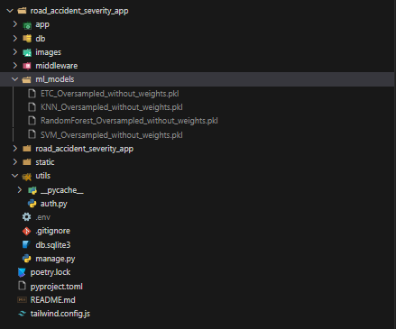
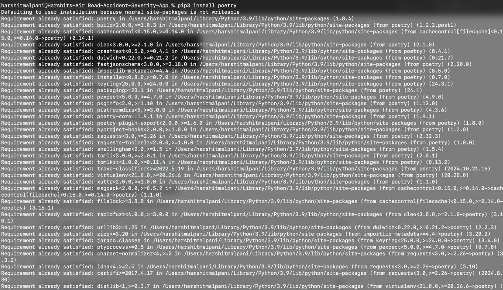
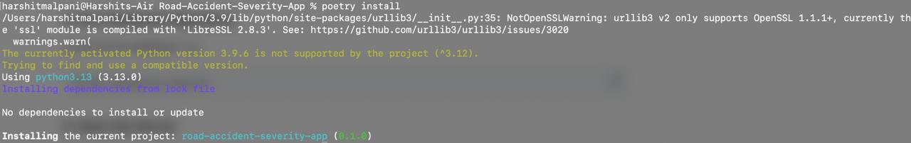
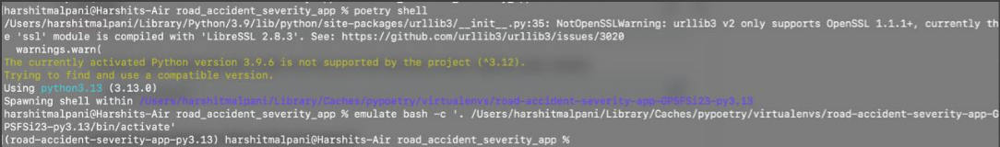
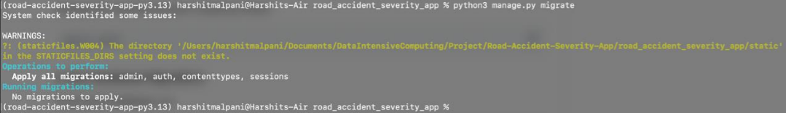
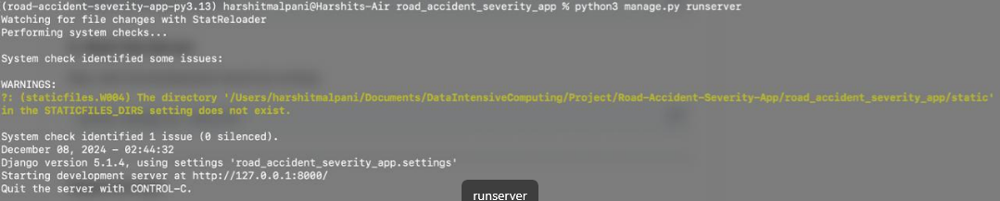

# DIC-Project-Team-28-Fall-24

<h4>Live Demo Link: <a href="http://34.70.177.116:8000/login/" target="_blank">http://34.70.177.116:8000/login/</a> </h4>

Team Number: 28
Team Members
1. Bhuvan Thirwani - 50565974

- Problem Statement 1: How does driving experience, road surface conditions, educational level affect the severity of accidents?
- Problem Statement 2: Analyzing how the fatality is related with various factors such as light conditions, weather conditions, type of collision & day of the week in traffic accidents. Finding patterns and correlations which can suggest road safety strategies.
- location(Code) : [50565974_phase2/DIC_Project_Phase_2_Bhuvan_Thirwani.ipynb](https://github.com/bhuvanUB/DIC-Project-Team-28-Fall-24/blob/3610266cc88730cca66b03b6e8705b70b15f74bf/50565974_phase2/DIC_Project_Phase_2_Bhuvan_Thirwani.ipynb)
- Report: [50565974_phase2/DIC_Project_Phase_2_Bhuvan_Thirwani_Report.pdf](https://github.com/bhuvanUB/DIC-Project-Team-28-Fall-24/blob/3610266cc88730cca66b03b6e8705b70b15f74bf/50565974_phase2/DIC_Project_Phase_2_Bhuvan_Thirwani_Report.pdf)

2. Harshit Malpani - 50608809
  - Question 1: Not all vehicles are involved in road accidents equally. Some vehicles have a higher tendency to be involved in any road accident
    - Location: https://github.com/bhuvanUB/DIC-Project-Team-28-Fall-24/blob/main/exp/DIC_Project_Harshit_Malpani_50608809.ipynb under Phase 2
  - Question 2: Does the service period of the vehicle and ownership of the vehicle have any correlation with the accidents
    - Location: https://github.com/bhuvanUB/DIC-Project-Team-28-Fall-24/blob/main/exp/DIC_Project_Harshit_Malpani_50608809.ipynb under Phase 2
  PDF: https://github.com/bhuvanUB/DIC-Project-Team-28-Fall-24/blob/3610266cc88730cca66b03b6e8705b70b15f74bf/DIC_Project_Harshit_Malpani_50608809.pdf

   
3. Piyush Gulhane  - 50608504
  Question 1 : What is the Impact of area, type of road cross-section, type of roads and road alignment on different types of Accidents.
  
  location(Code + Analysis) : [50608504/ph2/DIC_Project_Phase_2_prob1_50608504.ipynb](https://github.com/bhuvanUB/DIC-Project-Team-28-Fall-24/blob/3610266cc88730cca66b03b6e8705b70b15f74bf/50608504/ph2/DIC_Project_Phase_2_prob1_50608504.ipynb)  & [50608504/ph2/DIC_Project_Phase_2_prob1_50608504.pdf](https://github.com/bhuvanUB/DIC-Project-Team-28-Fall-24/blob/3610266cc88730cca66b03b6e8705b70b15f74bf/50608504/ph2/DIC_Project_Phase_2_prob1_50608504.pdf)
  
  Question 2 : What is the impact of Environmental factors, Light(visibility) impact, Road surface, time of the day, etc.
  
  location(Code + Analysis) : [50608504/ph2/DIC_Project_Phase_2_prob2_50608504.ipynb](https://github.com/bhuvanUB/DIC-Project-Team-28-Fall-24/blob/3610266cc88730cca66b03b6e8705b70b15f74bf/50608504/ph2/DIC_Project_Phase_2_prob2_50608504.ipynb)  & [50608504/ph2/DIC_Project_Phase_2_prob2_50608504.pdf](https://github.com/bhuvanUB/DIC-Project-Team-28-Fall-24/blob/3610266cc88730cca66b03b6e8705b70b15f74bf/50608504/ph2/DIC_Project_Phase_2_prob2_50608504.pdf)

## App Development

#### **App Features**
<h4>1. Login & Registraion</h4>
<h4>2. Add/Edit/Delete Data for Road Accidents</h4>
<h4>3. Predict Accident Severity</h4>
<h4>4. Dynamic Chart Visualtization from the Dataset</h4>
<h4>5. ML Model Results</h4>
<h4>6. Guidelines</h4>

This Instance may go down, if it goes down, I will update this link. Also, /login/ is important as / was not working.

**Setup Instructions**

<h3>1. Download the <code>ml_models.zip</code> File</h3>

First, download the <code>ml_models.zip</code> file from the following URL:

<a href="https://drive.google.com/file/d/10cMzD10C5Z5I2Zi-fZYxg8TdpM4yQV5r/view?usp=sharing" target="_blank">Download ml_models.zip</a>

<strong>Make sure to create a folder called <code>ml_models</code> in your project directory.</strong>

<h3>2. Install Dependencies</h3>

After setting up the <code>ml_models</code> folder, open your terminal/command prompt and follow these steps:

<ul>
    <li>Install Poetry (Dependency Manager):</li>
    <pre><code>pip install poetry</code></pre>
    
    <li>Install project dependencies (make sure you’re in the directory where <code>poetry.lock</code> exists):</li>
    <pre><code>poetry install</code></pre>
    
</ul>

<h3>3. Activate the Poetry Virtual Environment</h3>

Activate the virtual environment created by Poetry:

<pre><code>poetry shell</code></pre>

<h3>4. Run Database Migrations | You should be in road_accident_severity_app folder</h3>

To set up the database, run:

<pre><code>python manage.py migrate</code></pre>

<h3>5. Start the Server</h3>

Now, start the development server by running:

<pre><code>python manage.py runserver</code></pre>

**Register and Login**

Once the server is running, open your browser and go to the URL:

<pre><code>http://127.0.0.1:8000/login/</code></pre>

/login/ is important as / will not going to work

<h3>Register</h3>

First, register a new user by filling in the necessary details in the registration form.

<h3>Login</h3>

After registering, log in using your credentials.

**Start Using the Website**

Once logged in, you can start using the website and explore its features.

**Troubleshooting**

If you encounter any issues during the setup process, please ensure you’ve followed each step carefully. You can also check the following common issues:

<ul>
    <li>If <code>poetry install</code> doesn’t work, try updating Poetry by running:</li>
    <pre><code>pip install --upgrade poetry</code></pre>
    <li>Make sure that the virtual environment is activated before running server-related commands.</li>
</ul>